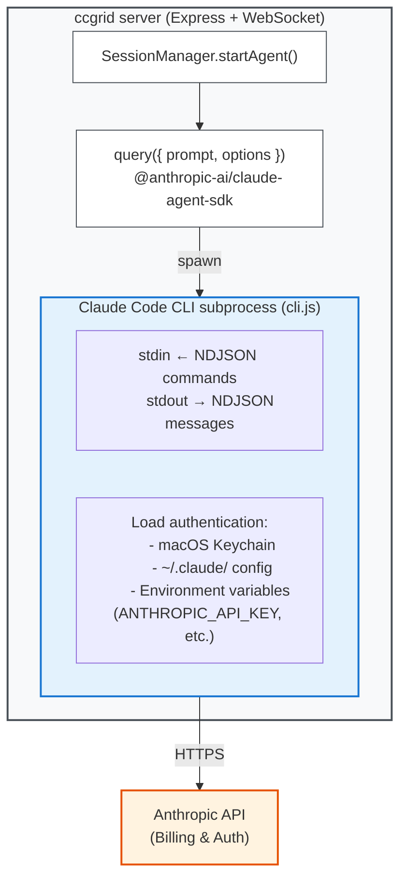

# Claude Agent SDK Architecture

This document explains how ccgrid utilizes Claude Code subscription accounts through the Agent SDK.

## Overview



## The SDK Reality: CLI Wrapper

`@anthropic-ai/claude-agent-sdk` **does NOT directly call the Anthropic API**.
Instead, it spawns the Claude Code CLI as a subprocess and communicates via NDJSON (newline-delimited JSON) over stdin/stdout.

When you call `query()`:

1. SDK spawns the embedded Claude Code CLI binary (`cli.js`)
2. CLI process loads local authentication credentials
3. CLI communicates with Anthropic API to execute the agent loop
4. All tool executions (Read, Write, Bash, etc.) are handled by the CLI
5. Results are returned to SDK as an NDJSON stream

```typescript
// SDK internal concept (simplified)
function query(params) {
  const child = spawn('node', ['cli.js', '--sdk-mode'], {
    env: params.options.env,
    cwd: params.options.cwd,
  });
  // Send prompt via stdin, receive results as stdout stream
}
```

## Authentication Flow

### SDK Has No Authentication Parameters

The `query()` Options type has **NO** fields like `apiKey` or `authToken`.
Authentication is fully delegated to the CLI subprocess.

### CLI Authentication Resolution Priority

| Priority | Source | Description |
|----------|--------|-------------|
| 1 | Environment variable `ANTHROPIC_API_KEY` | API key (pay-as-you-go) |
| 2 | Environment variable `CLAUDE_CODE_OAUTH_TOKEN` | OAuth token (subscription) |
| 3 | macOS Keychain | Credentials saved via `claude login` |
| 4 | `~/.claude/` config files | User settings |
| 5 | `.claude/settings.json` | Project settings |
| 6 | `apiKeyHelper` config | Dynamic retrieval via shell script |

### ccgrid Implementation

```typescript
// session-manager.ts L299-326
agentQuery = query({
  prompt,
  options: {
    cwd: session.cwd,
    model: session.model,
    env: {
      ...process.env,  // ← Inherit all environment variables
      CLAUDE_CODE_EXPERIMENTAL_AGENT_TEAMS: '1',
    },
    settingSources: ['user', 'project'],
    // ...
  },
});
```

`...process.env` passes server process environment variables to the CLI.
If authenticated via `claude login`, the CLI automatically reads credentials from Keychain.

**Conclusion**: ccgrid writes NO explicit authentication code.
If the host machine has run `claude login`, the SDK-launched CLI retrieves credentials from Keychain and operates with the subscription account.

## Authentication Methods

### 1. Subscription Authentication (OAuth)

```bash
# Login via CLI (opens browser)
claude login
```

- Available for Claude Pro / Max / Teams / Enterprise plans
- Credentials encrypted and stored in macOS Keychain
- **For personal use / internal tools**. Third-party products require Anthropic pre-approval

### 2. API Key Authentication (Pay-as-you-go)

```bash
export ANTHROPIC_API_KEY=sk-ant-...
```

- Issued at [platform.claude.com](https://platform.claude.com/)
- Pay based on usage
- **Required for third-party products**

### 3. Cloud Provider Integration

| Provider | Environment Variable |
|----------|---------------------|
| Amazon Bedrock | `CLAUDE_CODE_USE_BEDROCK=1` + AWS auth |
| Google Vertex AI | `CLAUDE_CODE_USE_VERTEX=1` + GCP auth |
| Microsoft Azure | `CLAUDE_CODE_USE_FOUNDRY=1` + Azure auth |

## SDK Usage in ccgrid

### query() Options

Where `startAgent()` in `session-manager.ts` calls the SDK:

```typescript
query({
  prompt,                          // Task instruction
  options: {
    // ---- Session management ----
    resume: session.sessionId,     // Resume existing session
    cwd: session.cwd,              // Working directory
    model: session.model,          // Model (e.g., claude-sonnet-4-5-20250929)

    // ---- Permissions ----
    permissionMode: 'acceptEdits', // or 'bypassPermissions'
    canUseTool,                    // Approval/denial callback from GUI

    // ---- Agent config ----
    maxTurns: 999999,              // Effectively unlimited
    maxBudgetUsd,                  // Cost limit (USD)
    includePartialMessages: true,  // Stream partial messages
    systemPrompt: buildSystemPrompt(),
    settingSources: ['user', 'project'],  // Read CLAUDE.md

    // ---- Environment ----
    env: {
      ...process.env,
      CLAUDE_CODE_EXPERIMENTAL_AGENT_TEAMS: '1',
    },
    abortController,               // Session abort control

    // ---- Hooks (Agent Teams) ----
    hooks: {
      SubagentStart:  [...],       // Subagent starts
      SubagentStop:   [...],       // Subagent stops
      TeammateIdle:   [...],       // Teammate goes idle
      TaskCompleted:  [...],       // Task completed
    },
  },
});
```

### Stream Processing

`query()` returns a `Query` object implementing `AsyncIterable<SDKMessage>`,
consumed by `processLeadStream()` in `lead-stream.ts` via `for await` loop.

```typescript
// lead-stream.ts (overview)
export async function processLeadStream(sessionId, agentQuery, deps) {
  for await (const message of agentQuery) {
    switch (message.type) {
      case 'assistant':     // Assistant response text
      case 'tool_use':      // Tool invocation
      case 'tool_result':   // Tool execution result
      case 'system':        // Session ID, cost info
      // ...
    }
  }
}
```

### Performance Characteristics

| Mode | Process Behavior | Latency |
|------|-----------------|---------|
| New session (`prompt: string`) | Spawn CLI process each time | Initial ~12 seconds |
| Resume session (`resume: sessionId`) | New process + state restore | ~12 seconds |
| Streaming input (`AsyncIterable`) | Persistent process | Initial ~12 seconds, fast thereafter |

ccgrid uses `prompt: string` mode, incurring ~12 second startup cost per session creation.
`continueSession()` uses the `resume` option to continue existing sessions.

## References

- [Agent SDK Overview](https://platform.claude.com/docs/en/agent-sdk/overview)
- [TypeScript SDK Reference](https://platform.claude.com/docs/en/agent-sdk/typescript)
- [Streaming vs Single Mode](https://platform.claude.com/docs/en/agent-sdk/streaming-vs-single-mode)
- [Claude Code Authentication](https://code.claude.com/docs/en/authentication)
- [npm: @anthropic-ai/claude-agent-sdk](https://www.npmjs.com/package/@anthropic-ai/claude-agent-sdk)
- [GitHub: claude-agent-sdk-typescript](https://github.com/anthropics/claude-agent-sdk-typescript)
