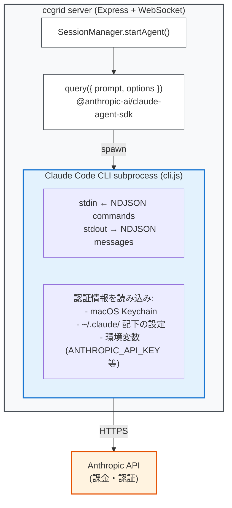

# Claude Agent SDK アーキテクチャ

ccgrid が Claude Code サブスクリプションアカウントを利用する仕組みを解説する。

## 全体像



## SDK の正体: CLI ラッパー

`@anthropic-ai/claude-agent-sdk` は **Anthropic API を直接呼ぶライブラリではない**。
内部で Claude Code CLI を子プロセスとして起動し、NDJSON (改行区切り JSON) で stdin/stdout 通信する。

つまり `query()` を呼ぶと:

1. SDK が内蔵の Claude Code CLI バイナリ (`cli.js`) を spawn
2. CLI プロセスがローカルの認証情報を読み込み
3. CLI が Anthropic API と通信してエージェントループを実行
4. ツール実行 (Read, Write, Bash 等) もすべて CLI 側で処理
5. 結果が NDJSON ストリームとして SDK に返却

```typescript
// SDK の内部イメージ (簡略)
function query(params) {
  const child = spawn('node', ['cli.js', '--sdk-mode'], {
    env: params.options.env,
    cwd: params.options.cwd,
  });
  // stdin でプロンプトを送信、stdout で結果をストリーム受信
}
```

## 認証フロー

### SDK に認証パラメータは存在しない

`query()` の Options 型に `apiKey` や `authToken` といったフィールドは**ない**。
認証は完全に CLI サブプロセスに委譲される。

### CLI が認証情報を解決する優先順位

| 優先度 | ソース | 説明 |
|--------|--------|------|
| 1 | 環境変数 `ANTHROPIC_API_KEY` | API キー (従量課金) |
| 2 | 環境変数 `CLAUDE_CODE_OAUTH_TOKEN` | OAuth トークン (サブスクリプション) |
| 3 | macOS Keychain | `claude login` で保存された認証情報 |
| 4 | `~/.claude/` 配下の設定ファイル | ユーザー設定 |
| 5 | `.claude/settings.json` | プロジェクト設定 |
| 6 | `apiKeyHelper` 設定 | シェルスクリプト経由で動的に取得 |

### ccgrid の場合

```typescript
// session-manager.ts L299-326
agentQuery = query({
  prompt,
  options: {
    cwd: session.cwd,
    model: session.model,
    env: {
      ...process.env,  // ← ここで環境変数を丸ごと継承
      CLAUDE_CODE_EXPERIMENTAL_AGENT_TEAMS: '1',
    },
    settingSources: ['user', 'project'],
    // ...
  },
});
```

`...process.env` でサーバープロセスの環境変数を CLI に渡している。
`claude login` でサブスクリプション認証済みなら、Keychain の認証情報が CLI に自動で読まれる。

**結論**: ccgrid は明示的な認証コードを一切書いていない。
ホストマシンで `claude login` 済みであれば、SDK 経由の CLI が Keychain から認証情報を取得し、サブスクリプションアカウントで動作する。

## 認証方式の種類

### 1. サブスクリプション認証 (OAuth)

```bash
# CLI でログイン (ブラウザが開く)
claude login
```

- Claude Pro / Max / Teams / Enterprise プランで利用可能
- 認証情報は macOS Keychain に暗号化保存
- **個人利用・社内ツール向け**。サードパーティ製品での利用は Anthropic の事前承認が必要

### 2. API キー認証 (従量課金)

```bash
export ANTHROPIC_API_KEY=sk-ant-...
```

- [platform.claude.com](https://platform.claude.com/) で発行
- 使用量に応じた従量課金
- **サードパーティ製品で必須**

### 3. クラウドプロバイダ経由

| プロバイダ | 環境変数 |
|-----------|---------|
| Amazon Bedrock | `CLAUDE_CODE_USE_BEDROCK=1` + AWS 認証 |
| Google Vertex AI | `CLAUDE_CODE_USE_VERTEX=1` + GCP 認証 |
| Microsoft Azure | `CLAUDE_CODE_USE_FOUNDRY=1` + Azure 認証 |

## ccgrid での SDK 利用詳細

### query() のオプション

`session-manager.ts` の `startAgent()` が SDK を呼び出す箇所:

```typescript
query({
  prompt,                          // タスク指示文
  options: {
    // ---- セッション管理 ----
    resume: session.sessionId,     // 既存セッションの再開時
    cwd: session.cwd,              // 作業ディレクトリ
    model: session.model,          // モデル (claude-sonnet-4-5-20250929 等)

    // ---- パーミッション ----
    permissionMode: 'acceptEdits', // or 'bypassPermissions'
    canUseTool,                    // GUI からの許可/拒否コールバック

    // ---- エージェント設定 ----
    maxTurns: 999999,              // 実質無制限
    maxBudgetUsd,                  // コスト上限 (USD)
    includePartialMessages: true,  // 部分メッセージのストリーミング
    systemPrompt: buildSystemPrompt(),
    settingSources: ['user', 'project'],  // CLAUDE.md を読む

    // ---- 環境 ----
    env: {
      ...process.env,
      CLAUDE_CODE_EXPERIMENTAL_AGENT_TEAMS: '1',
    },
    abortController,               // セッション停止用

    // ---- フック (Agent Teams) ----
    hooks: {
      SubagentStart:  [...],       // サブエージェント起動時
      SubagentStop:   [...],       // サブエージェント停止時
      TeammateIdle:   [...],       // チームメイトがアイドルに
      TaskCompleted:  [...],       // タスク完了時
    },
  },
});
```

### ストリーム処理

`query()` は `Query` オブジェクトを返す。これは `AsyncIterable<SDKMessage>` を実装しており、
`lead-stream.ts` の `processLeadStream()` で `for await` ループで消費される。

```typescript
// lead-stream.ts (概要)
export async function processLeadStream(sessionId, agentQuery, deps) {
  for await (const message of agentQuery) {
    switch (message.type) {
      case 'assistant':     // アシスタントの応答テキスト
      case 'tool_use':      // ツール呼び出し
      case 'tool_result':   // ツール実行結果
      case 'system':        // セッションID・コスト情報
      // ...
    }
  }
}
```

### パフォーマンス特性

| モード | プロセス挙動 | レイテンシ |
|--------|-------------|-----------|
| 新規セッション (`prompt: string`) | 毎回 CLI プロセスを spawn | 初回 ~12 秒 |
| セッション再開 (`resume: sessionId`) | 新プロセス + 状態復元 | ~12 秒 |
| ストリーミング入力 (`AsyncIterable`) | プロセス持続 | 初回 ~12 秒、以降は高速 |

ccgrid は `prompt: string` モードを使用しており、セッション作成ごとに ~12 秒の起動コストが発生する。
`continueSession()` では `resume` オプションで既存セッションを引き継ぐ。

## 参考リンク

- [Agent SDK Overview](https://platform.claude.com/docs/en/agent-sdk/overview)
- [TypeScript SDK Reference](https://platform.claude.com/docs/en/agent-sdk/typescript)
- [Streaming vs Single Mode](https://platform.claude.com/docs/en/agent-sdk/streaming-vs-single-mode)
- [Claude Code Authentication](https://code.claude.com/docs/en/authentication)
- [npm: @anthropic-ai/claude-agent-sdk](https://www.npmjs.com/package/@anthropic-ai/claude-agent-sdk)
- [GitHub: claude-agent-sdk-typescript](https://github.com/anthropics/claude-agent-sdk-typescript)
